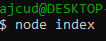

# Team Profile Generator

## Description

This project will generate a roster of your team in and HTML document that you can then open

## Table of Contents

- [Installation](#installation)
- [Usage](#usage)
- [Instructions](#instructions)
- [Final Product Preview](#Final-Product-Preview)
- [License](#license)
- [Questions](#questions)

## Installation

In order to install this project you must clone this project on to your local machine.

## Usage

This project usage is for anyone that needs to make a team profile roster with a clean design!

## Instructions

- If you would like to view a video on how to install and use, go to my [Youtube Channel](https://www.youtube.com/)

- Step 1: Clone this repository

- Step 2: Open project in your terminal and run 'npm install' to install all dependencies

- Step 3: Run 'node index' in the terminal while in root directory of the cloned project

- Step 4: Answer the prompts

- Step 5: Once you finish answering the prompts type 'code .' in the terminal

Step 6: Navigate to the dist folder

- Step 7: An HTML File will be created that you can then open in your browser to view all your employees!

## Final Product Preview

## License

This application is covered under the [MIT license](LICENSE)

## Questions

Created by: [ajcuddeback](https://github.com/ajcuddeback)

If you have any further questions please feel free to contact me at [ajcuddeback@gmail.com](ajcuddeback@gmail.com)
